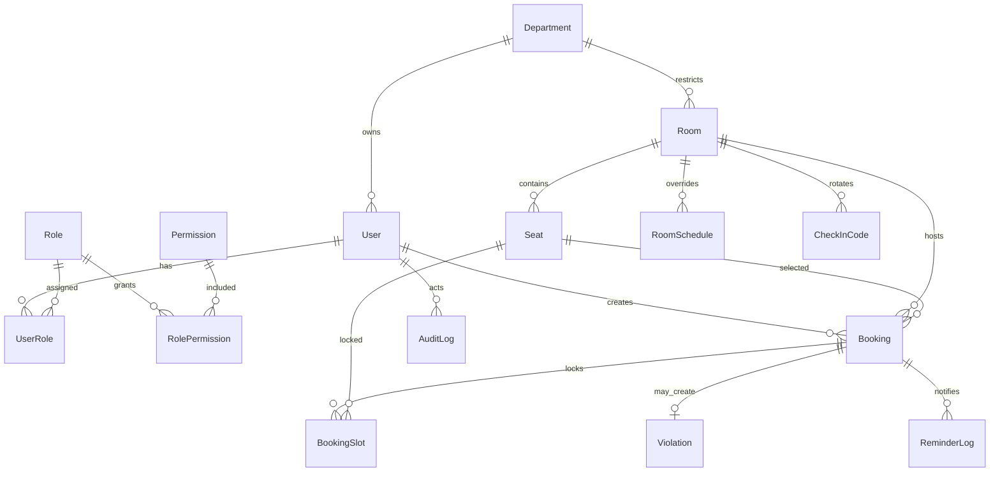

# I0 ER 关系说明

```mermaid
erDiagram
  Department ||--o{ User : owns
  Department ||--o{ Room : restricts
  User ||--o{ UserRole : has
  Role ||--o{ UserRole : assigned
  Role ||--o{ RolePermission : grants
  Permission ||--o{ RolePermission : included
  Room ||--o{ Seat : contains
  Room ||--o{ RoomSchedule : overrides
  User ||--o{ Booking : creates
  Room ||--o{ Booking : hosts
  Seat ||--o{ Booking : selected
  Booking ||--o{ BookingSlot : locks
  Seat ||--o{ BookingSlot : locked
  Booking ||--o| Violation : may_create
  Room ||--o{ CheckInCode : rotates
  Booking ||--o{ ReminderLog : notifies
  User ||--o{ AuditLog : acts
```

`booking_slot` 是后续预约并发控制的关键表。每个预约按小时拆成多条 slot，数据库唯一约束 `(seat_id, slot_start)` 负责拦截同座同小时的并发重复预约。
