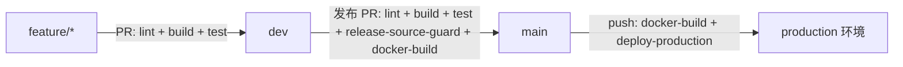

# GitHub Actions CI/CD 设置

本项目采用两级分支流：



## 分支规则

### dev

`dev` 是日常集成分支。所有功能提交都应先建 `feature/<story-id>-<slug>` 分支，再通过 PR 合入 `dev`，不要直接推送到 `dev`。PR 合并后删除对应 feature 分支。

Ruleset 建议：

- Target branches: `dev`
- Restrict deletions
- Block force pushes
- Require a pull request before merging
- Required approvals: `1`
- Require status checks to pass:
  - `lint`
  - `build`
  - `test`

### main

`main` 是发布分支。只允许 `dev -> main` 的发布 PR。

Ruleset 建议：

- Target branches: `main`
- Restrict deletions
- Block force pushes
- Require a pull request before merging
- Required approvals: `1`
- Require status checks to pass:
  - `lint`
  - `build`
  - `test`
  - `release-source-guard`
  - `docker-build`

`release-source-guard` 会拒绝任何不是从 `dev` 发起到 `main` 的 PR。`docker-build` 会构建 API、学生端、管理端三个镜像；PR 阶段只构建验证，`main` push 阶段会推送到 GHCR。

## 自动部署

当 `main` 有新的 merge commit 时，`deploy-production` 会自动执行。

在 GitHub 仓库中创建 `production` Environment，并配置以下 Environment secrets：

| Secret | 说明 |
|---|---|
| `PROD_SSH_HOST` | 生产服务器地址；未配置时默认使用 `cd-server` |
| `PROD_SSH_USER` | SSH 用户 |
| `PROD_SSH_PRIVATE_KEY` | 部署私钥 |
| `PROD_DEPLOY_PATH` | 服务器上的仓库目录 |

服务器目录需要提前 clone 本仓库，并安装 Docker / Docker Compose。部署命令会在服务器执行：

```bash
git pull --ff-only origin main
docker compose -f infra/docker-compose.prod.yml pull
docker compose -f infra/docker-compose.prod.yml up -d
```

如果 GHCR package 是私有的，`cd-server` 需要提前 `docker login ghcr.io`。如果还没有生产服务器，可以先不要把 `deploy-production` 设为 required check；等 secrets 和服务器准备好后再启用。
