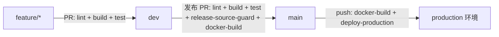

# GitHub Actions CI/CD 设置

本项目采用两级分支流：



## 分支规则

### dev

`dev` 是日常集成分支。所有功能提交都应先建 `feature/<story-id>-<slug>` 分支，再通过 PR 合入 `dev`，不要直接推送到 `dev`。PR 合并后删除对应 feature 分支。

Ruleset 建议：

- Target branches: `dev`
- Restrict deletions
- Block force pushes
- Require a pull request before merging
- Required approvals: `1`
- Require status checks to pass:
  - `lint`
  - `build`
  - `test`

### main

`main` 是发布分支。只允许 `dev -> main` 的发布 PR。

Ruleset 建议：

- Target branches: `main`
- Restrict deletions
- Block force pushes
- Require a pull request before merging
- Required approvals: `1`
- Require status checks to pass:
  - `lint`
  - `build`
  - `test`
  - `release-source-guard`
  - `docker-build`

`release-source-guard` 会拒绝任何不是从 `dev` 发起到 `main` 的 PR。`docker-build` 会构建 API 和统一 Web 入口两个镜像；PR 阶段只构建验证，`main` push 阶段会推送到配置的镜像仓库。默认仓库是 GHCR。

## 自动部署

当 `main` 有新的 merge commit 时，`deploy-production` 会自动执行。

在 GitHub 仓库中创建 `production` Environment，并配置以下 Environment secrets：

| Secret | 说明 |
|---|---|
| `PROD_SSH_HOST` | 生产服务器地址；未配置时默认使用 `cd-server` |
| `PROD_SSH_USER` | SSH 用户 |
| `PROD_SSH_PRIVATE_KEY` | 部署私钥 |
| `PROD_DEPLOY_PATH` | 服务器上的仓库目录 |
| `PROD_REGISTRY_USERNAME` | 可选；国内 Registry 或私有 GHCR 的登录用户名 |
| `PROD_REGISTRY_PASSWORD` | 可选；国内 Registry 或私有 GHCR 的登录密码 / token |

镜像仓库通过 Repository / Environment variables 配置；不配置时使用 GHCR：

| Variable | 默认值 | 说明 |
|---|---|---|
| `PROD_IMAGE_REGISTRY` | `ghcr.io` | 镜像仓库域名。国内部署建议改为云厂商 Registry，例如 ACR / TCR / SWR 的域名 |
| `PROD_IMAGE_NAMESPACE` | `${owner}/${repo}` | 镜像命名空间；国内 Registry 通常填写账号下的 namespace |
| `PROD_API_IMAGE_REPOSITORY` | `${PROD_IMAGE_REGISTRY}/${PROD_IMAGE_NAMESPACE}/api` | 可选；API 镜像完整仓库名，不含 tag |
| `PROD_WEB_ADMIN_IMAGE_REPOSITORY` | `${PROD_IMAGE_REGISTRY}/${PROD_IMAGE_NAMESPACE}/web-admin` | 可选；统一 Web 入口镜像完整仓库名，不含 tag |
| `PROD_API_PUBLIC_URL` | 无默认值 | 生产 Web 构建注入的 API 公网地址，例如 `http://xmwhzl.love:13000` |
| `PROD_API_PORT` | `3000` | 可选；服务器上的 API 端口映射，支持纯端口或 `127.0.0.1:13000` 这种仅本机监听的绑定 |
| `PROD_WEB_ADMIN_PORT` | `5174` | 可选；服务器上的 Web 端口映射，支持纯端口或 `127.0.0.1:15175` 这种仅本机监听的绑定 |
| `PROD_CORS_ALLOWED_ORIGINS` | 服务器 `.env` 中的 `CORS_ALLOWED_ORIGINS` 或本地开发默认值 | 可选；生产 API 允许携带凭证跨域访问的前端 Origin 白名单，多个值用英文逗号分隔，例如 `http://xmwhzl.love:5174,https://ibooking.example.edu.cn` |

两个完整仓库名必须使用同一个 Registry host，便于 workflow 用同一组凭证登录并推送 / 拉取。

示例：阿里云 ACR 如果不支持多级仓库路径，可直接配置两项完整仓库名：

```text
PROD_API_IMAGE_REPOSITORY=registry.cn-hangzhou.aliyuncs.com/<namespace>/ibooking-api
PROD_WEB_ADMIN_IMAGE_REPOSITORY=registry.cn-hangzhou.aliyuncs.com/<namespace>/ibooking-web
```

`main` 部署时不会依赖 `latest`，workflow 会把本次 commit SHA 对应的两个镜像写入服务器 `infra/.deploy-images.env`，再执行 `docker compose --env-file infra/.deploy-images.env ... pull/up`，确保部署版本和构建版本一致。

服务器目录需要提前 clone 本仓库，并安装 Docker / Docker Compose。部署命令会在服务器执行：

```bash
git pull --ff-only origin main
docker compose --env-file infra/.deploy-images.env -f infra/docker-compose.prod.yml pull
docker compose --env-file infra/.deploy-images.env -f infra/docker-compose.prod.yml up -d
```

## 国内镜像策略

生产服务器在国内时，优先把项目镜像推送到国内 Registry，而不是只配置 Docker Hub mirror。

- Docker 的 `registry-mirrors` 主要用于加速 Docker Hub / `docker.io` 的基础镜像拉取，不会加速 `ghcr.io/xumingw/devops_ibooking/...` 这种项目镜像。
- 国内 Registry 推荐选择服务器同云厂商同地域，例如阿里云 ACR、腾讯云 TCR、华为云 SWR。把 `PROD_IMAGE_REGISTRY` / `PROD_*_IMAGE_REPOSITORY` 指向该 Registry，并配置 `PROD_REGISTRY_USERNAME`、`PROD_REGISTRY_PASSWORD`。
- Docker Hub mirror 仍可作为补充配置，用于服务器临时拉取 `mysql`、`redis`、`nginx`、`node` 等 Docker Hub 镜像。配置时应使用云厂商控制台提供的专属加速地址，不要依赖不稳定的第三方公共 mirror。

Docker Hub mirror 的服务器配置模板：

```json
{
  "registry-mirrors": ["https://<your-provider-mirror>"]
}
```

配置后重启 Docker 并验证：

```bash
systemctl restart docker
docker info | grep -A 5 "Registry Mirrors"
```

如果 GHCR package 是私有的，`cd-server` 需要提前 `docker login ghcr.io`，或在 `production` Environment 配置 `PROD_REGISTRY_USERNAME` / `PROD_REGISTRY_PASSWORD` 让 workflow 自动登录服务器。国内 Registry 通常也需要这两个 secret。如果还没有生产服务器，可以先不要把 `deploy-production` 设为 required check；等 secrets 和服务器准备好后再启用。
